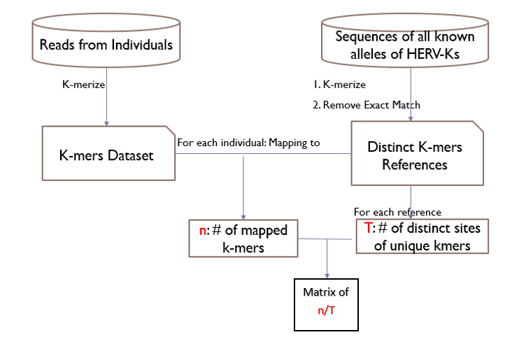
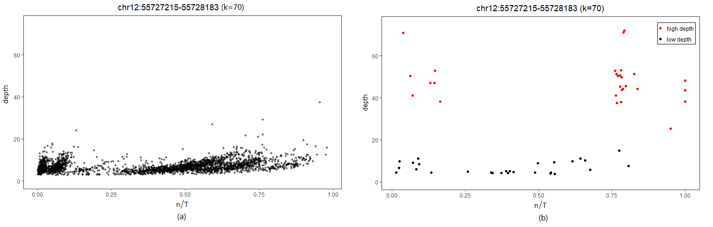
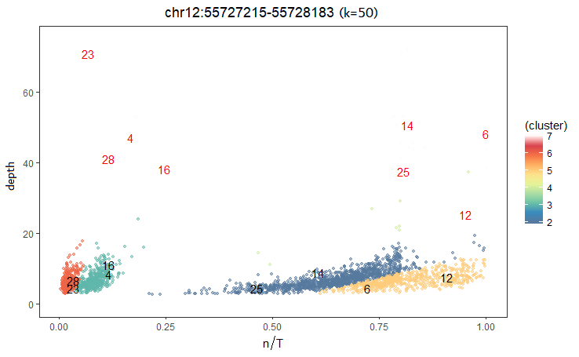
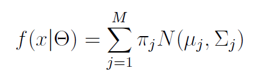
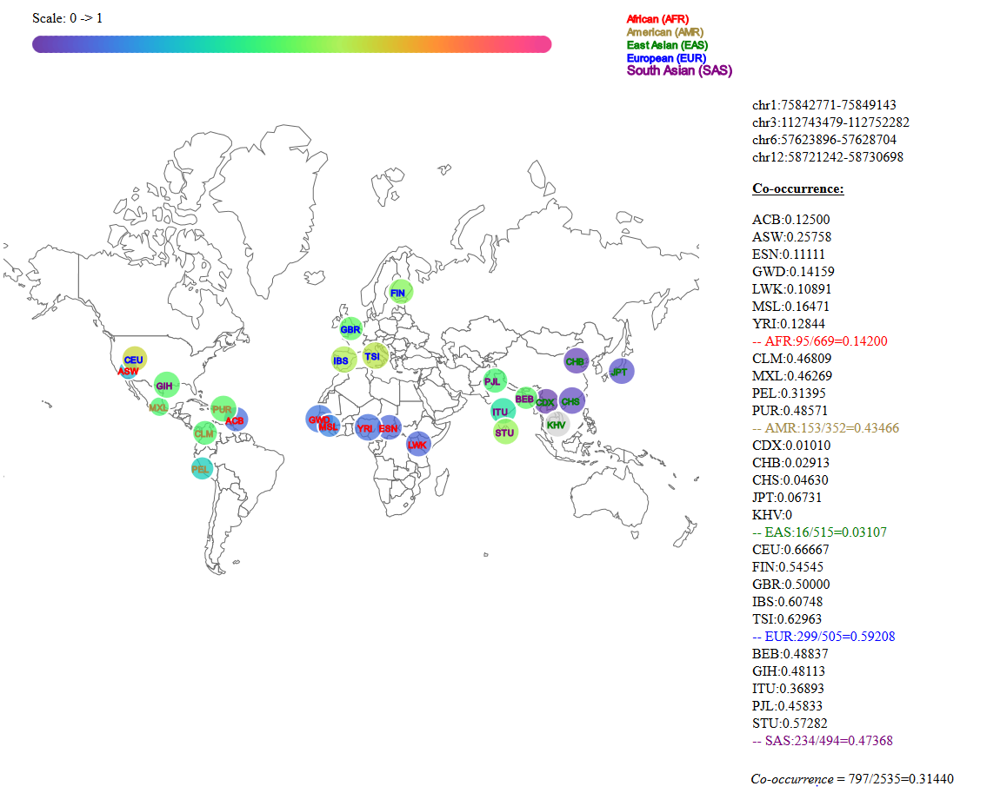

K-mer base approach to mine patterns and leverage the repetitive nature of sequencing data

Instructions:

1. generating unique k-mer reference

perl generatedataset.pl <rawfile> <LengthofSample> <outputfile>  -> samples.fasta  # len=50

perl filtering.pl <filename> <out>   -> cleandata (sample \t lable) // remove duplications, and multi-labels

perl cleaning.pl <samples.fasta> <cleandata> <reference.fasta>
 

2. mapping reads from individual to reference

perl findmatch.pl reference.fa fasta_dir/ output_dir/ K [individuals]  

perl labelcount.pl output_dir/individual.dat Sites output_dir/individual.label

3. mixture model for low coverage data
clustering/

4. Visualization tool
visualization/Welcome.html
-----------------------------------------------------------------------
Demo
1. raw data: short read DNA sequencing (100bps)

2. k-mer counting method

3. difficulties

4. clustering results (from mixture models)

5. (Truncated) Dirichlet process Gaussian mixture model

(1) density function for GMM

(2) dirichlet process prior for \theta

6. visualization of prevalence: D3.js map

http://personal.psu.edu/~wul135/visualization/Welcome.html

